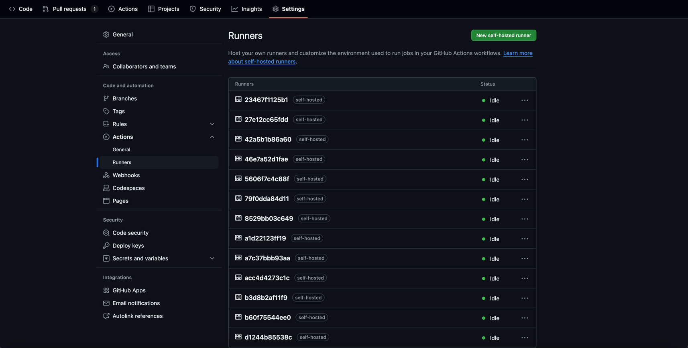
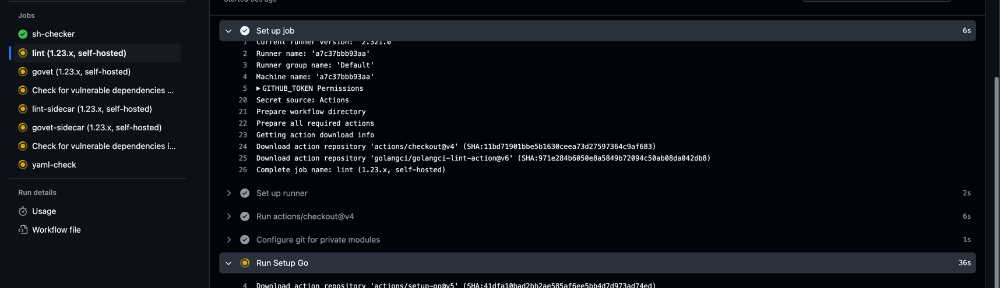

#### Inventory
- Dockerfile: dockerfile
- docker: alias to docker specific to this gh runner implementation
- docker-setup.sh: sets up docker on host, if this is not already done by the user
- start.sh: creates and registers the github runner
- compose.yml: controls the infrastructure available to the github runner

#### Setup docker on host, if not already setup
```
chmod +x *.sh
./docker-setup.sh
```

#### Build the runner Dockerfile, or simply pull from https://hub.docker.com/repository/docker/allanrogerreid/github-runner-image/general
Note usage of host docker group id. This is to ensure that the Docker-in-Docker (DinD) uses the host docker socket
```
docker build --tag allanrogerreid/github-runner-image:latest --build-arg HOST_GID=$(getent group docker | awk -F: '{print $3}') .
```

#### Optional: if building, then you can also push to docker and retrieve later e.g.
```
docker login --username=allanrogerreid
docker push allanrogerreid/github-runner-image:latest
```

#### First modify compose.yml as required e.g.
```
services:
  runner:
    image: allanrogerreid/github-runner-image:latest 
    restart: always 
    environment:
      - OWNER_REPO_OR_ORG=repos/<GitHub user name>/<GitHub repo name>
      - GH_TOKEN=<GitHub classic token with  with repo scope>
      - GH_RUNNER_USER=docker
      - GH_RUNNER_OPTIONS=--labels self-hosted --no-default-labels
    deploy:
      mode: replicated
      replicas: 4
      # Configures the upper and lower limits of cpu and memory 
      resources:
        limits:
          cpus: '0.25' 
          memory: 256M 
        reservations:
          cpus: '0.10'
          memory: 128M
    volumes:
      # Share docker docker with host
      - /var/run/docker.sock:/var/run/docker.sock
      - /usr/bin/docker:/usr/bin/docker
```
#### Create runners.
```
docker compose up --scale runner=10
```

#### Observe runners


#### Run GitHub workflows e.g. from a PR
